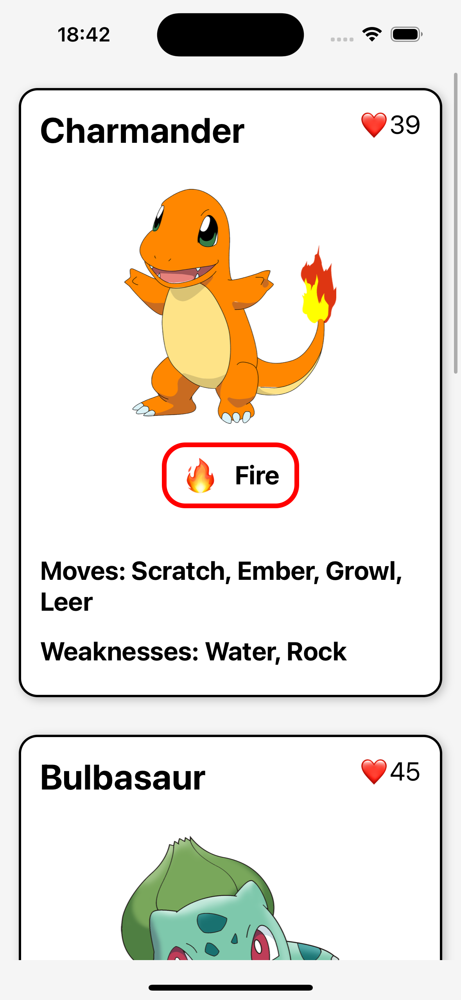

1. **Unzip the project:**
   ```bash
   unzip project_name.zip

2. **Navigate to the project directory:**
    ```bash
    cd project_name

3. **Install dependencies (if not already installed):**
    ```bash
    npm install
    or
    yarn install

4. **Run the project:**
    ```bash
    npm start
    or
    expo start
    ```

5. **Open the project on your device using the Expo app:**
6. **Scan the QR code with your device's camera:**
7. **Enjoy!**
8. **If you have any questions or feedback, feel free to contact me!**
9. **Thank you!**

*Screenshot of the project:*

